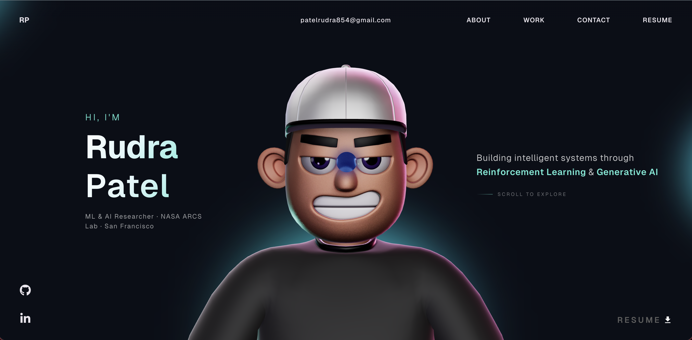

# Rudra's Portfolio Website 🚀

A modern, interactive portfolio website showcasing my work and skills as a full-stack developer.

## Preview



## Features ✨

- **Interactive 3D Character**: Engaging 3D model with mouse interactions
- **Smooth Animations**: Powered by GSAP for fluid user experience
- **Responsive Design**: Optimized for all devices and screen sizes
- **Fast Performance**: Built with Vite for quick loading times
- **TypeScript**: Type-safe development for better code quality
- **Modern Tech Stack**: React, Three.js, and cutting-edge web technologies

## Tech Stack 🛠️

- **Frontend Framework**: React 18 with TypeScript
- **3D Graphics**: Three.js, React Three Fiber, React Three Drei
- **Animations**: GSAP (GreenSock Animation Platform)
- **Physics**: React Three Rapier for realistic interactions
- **Build Tool**: Vite
- **Styling**: CSS with custom animations
- **Analytics**: Vercel Analytics

## Getting Started 🚀

### Prerequisites

- Node.js (version 16 or higher)
- npm or yarn package manager

## GSAP License Note ⚠️

This project uses GSAP (GreenSock Animation Platform) for smooth animations. As of April 30, 2025, GSAP is 100% FREE, including all bonus plugins like ScrollSmoother and SplitText. No membership required!

## Contributing 🤝

Contributions are welcome! Please feel free to submit a Pull Request.

## Deployment 🚀

This project is configured for easy deployment on Vercel.

### Deploy to Vercel

1. **Connect your GitHub repository** to Vercel
2. **Import the project** from your GitHub repo
3. **Configure build settings** (should auto-detect):
   - **Build Command**: `npm run build`
   - **Output Directory**: `dist`
   - **Install Command**: `npm install`
4. **Deploy!** Vercel will automatically build and deploy your site

### Local Build Test

Before deploying, test the build locally:

```bash
npm run build
npm run preview
```

## License 📄

This project is open source and available under the [MIT License](LICENSE).

## Contact 📧

- **LinkedIn**: [\[Your LinkedIn Profile\]](https://www.linkedin.com/in/rrudra-patel/)
- **Email**: patelrudra854@gmail.com

---

Built with ❤️ using React, TypeScript, and Three.js
